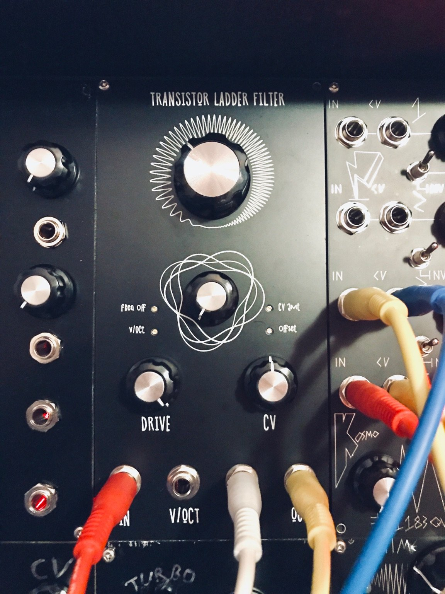

A Kosmo version of the [Kassutronics transistor ladder filter](https://kassu2000.blogspot.com/2018/07/transistor-ladder-filter.html).

Find the documentation here: (https://github.com/kassu/kassutronics/tree/master/documentation/Transistor%20Ladder%20Filter)

You need to match the transistors, which is a bit boring. Those that I got where
already pretty close (within the recommended 2mV limit), but some outliers, so
maaaybe you could just try without matching.
